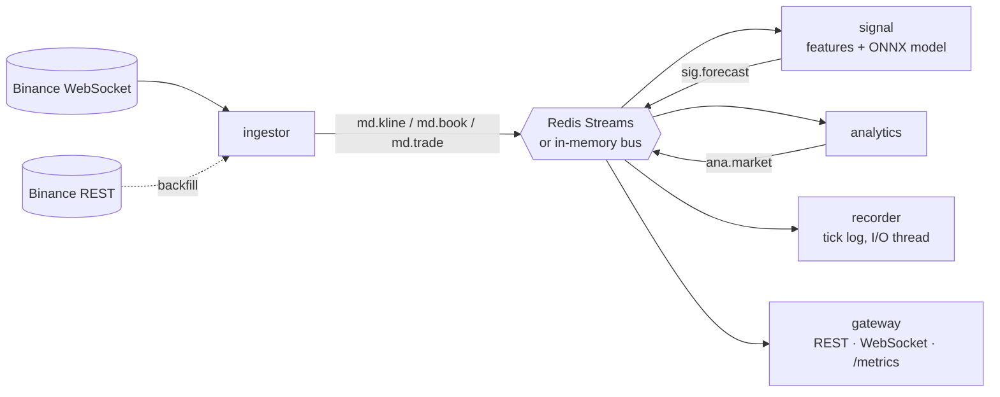

**English** | [Tiếng Việt](README.vi.md)

# Real-time market-data processing: CPU and I/O optimisation

An event-driven system that ingests live Binance market data and does four things:
- computes features incrementally;
- runs a CNN → BiLSTM → attention forecaster;
- analyses market microstructure;
- serves results over REST and WebSocket.

It runs as microservices over Redis Streams, or as a single process over an in-memory bus.

The model is not the subject. The subject is **how much of a typical PyTorch pipeline's time
goes to overhead instead of computation, and how to get it back on a CPU**:
- framework dispatch;
- thread pools;
- recomputation;
- serialisation;
- disk formats;
- operating-system scheduling.

Everything is measured with reproducible benchmarks. Full numbers:
**[RESULTS_BENCHMARK.md](RESULTS_BENCHMARK.md)**.

---

## 1. The problem: unoptimised PyTorch pipelines spend most of their time on overhead

The starting point was a typical research pipeline, kept in `ModelTrade/` for reference:
- pandas recomputes every indicator on each bar;
- a PyTorch model runs in eager mode with the default thread pool;
- JSON carries the data;
- the OS decides where every thread runs.

Measured on the same machine, in the same session:

| Symptom | Measurement |
|---|---|
| **The per-bar path is slow, and almost none of it is useful work** | 35–57 ms per bar. 35–44% goes to pandas recomputing indicators over the whole history, 56–63% to PyTorch eager inference. |
| **Eager PyTorch is mostly overhead at batch 1** | The same model computes in **181 µs** on ONNX Runtime with 1 thread versus **4,224 µs** in PyTorch eager with 12 threads. More than 95% of the eager call is Python dispatch plus thread-pool synchronisation. |
| **More threads ≠ faster** | Inference: 1 thread is 6.4× faster than 12 in PyTorch. Training: the torch default of 14 threads is only **1.6× faster than 1 thread** (≈12% parallel efficiency), and 8 threads are slower than 4. |
| **Architecture ignores the serial bottleneck** | A 2-layer BiLSTM over 64 steps costs ~2.3 ms per training sample. Shortening the serial recurrence (1 layer over 32 steps) brings it to ~0.24 ms: **~9×**. |
| **The data pipeline copies instead of indexing** | Materialising every training window takes ~645 MB; gathering batches by index from the feature matrix takes ~7 MB. |
| **The OS can idle the fast cores** | Windows 11 EcoQoS can park background worker processes on E-cores while the P-cores stay 10–27% busy, making batch jobs **2–3× slower**. |

The waste sits in the layers around the model, not in the arithmetic. So the fixes are
systems work: change the algorithm, the runtime, the memory layout, the wire and disk
formats, and the CPU placement.

---

## 2. What was changed

### 2.1 Hot path and I/O

| Bottleneck | Change | Effect (same-session ratio) |
|---|---|---|
| pandas recompute on every bar | Incremental **numba** kernel: recursive state (EMA/RSI/ATR) plus a fixed 64-row window. The same kernel serves training and live, verified bit for bit. | **1,780×** (micro), **483–497×** in the pipeline |
| PyTorch eager, default threads | **ONNX Runtime with 1 intra-op thread**, static batch-1 graph, warm-up at load | **23×** |
| Long serial LSTM | Two stride-2 convolutions shrink 128 steps to 32 before a single BiLSTM layer | **2.6×** inference, **~9×** training per sample |
| Window copies per inference | Double-write **ring buffer**: the latest *n* rows are always contiguous, so they go straight into numba and ONNX Runtime as a zero-copy view | 2.4–3.2× for normalise + input |
| JSON dicts on the wire | **msgspec** structs, array-encoded **msgpack** | ~10–11× faster, 2.1–2.5× smaller |
| Parse JSON → dict → `float(str)` | Typed msgspec decoding straight into structs | 1.24–1.75× |
| `.npy` float64 history | **QCOL** columnar format: exact scaled int64 → delta → byte-shuffle → zstd, lossless, decoded in parallel | **4× smaller** (2.8× vs Parquet+zstd) |
| No tick storage | `recorder` service: append-only, block-compressed tick log; compression and writes on a dedicated I/O thread | **16 B/msg** on disk, 0.4 µs per message on the event loop |
| Sequential REST pagination | Concurrent chunked backfill with retry/back-off | 86k bars in 3.6 s |

### 2.2 Experiment: pinned + dynamic queue vs Windows scheduling

**Question:** on a hybrid CPU, is it enough to turn every core on and let Windows schedule?
Or should the work be dispatched explicitly?

**Setup** (`benchmarks/bench_hetero.py`):
- 20 worker processes, one per logical CPU; process start-up is never timed.
- Two workloads: batch model inference (SIMD-heavy) and tick decoding plus analytics
  (Python-heavy).
- All workers are released together. The metric is the **makespan**: the time until the
  last worker finishes.
- Same total work for every strategy, fresh processes for every configuration, rotated
  order, 3 rounds.
- CPU utilisation of the P- and E-core groups is sampled during every run.

**Strategies compared** (11 in total; the main ones):

| Strategy | What it means |
|---|---|
| All cores + equal split + Windows scheduling (baseline) | every worker gets the same share; Windows places and moves the processes |
| Windows scheduling + **dynamic queue** | workers pull small chunks from a shared counter until the work runs out |
| **Pinned + equal split** | every process is fixed to one logical CPU with an affinity mask; same share each |
| Pinned + **speed-proportional split** | shares proportional to per-core speed, calibrated with all workers running |
| **Pinned + dynamic queue** | fixed placement, and fast cores automatically take more chunks |
| P-cores only + dynamic queue | reference: what the E-cores contribute |

**Results, this session** (makespan; speed-up vs the baseline in brackets):

| Strategy | Inference | Ticks | Idle share |
|---|---:|---:|---:|
| All cores, equal split, Windows (baseline) | 2.81 s | 2.88 s | 9–12% |
| Windows + dynamic queue | 2.58 s (1.09×) | 2.68 s (1.08×) | 1% |
| Pinned + equal split | 3.30 s (**0.85×**) | 3.26 s (**0.88×**) | 25–27% |
| Pinned + speed-proportional | 2.57 s (1.09×) | 2.94 s (0.98×) | 9–15% |
| **Pinned + dynamic queue** | **2.61 s (1.08×)** | **2.64 s (1.09×)** | **1–2%** |
| P-cores only + dynamic queue | 3.40 s (0.83×) | 4.06 s (0.71×) | 1% |

**Pinned + dynamic vs Windows + dynamic, across sessions:**

| Session | What Windows did | Inference | Ticks |
|---|---|---:|---:|
| A | EcoQoS parked the workers on E-cores (P-cores 12–13% busy) | **3.27×** faster pinned | **2.60×** faster pinned |
| B | used every core | 1.00× | 1.10× |
| C (current) | used every core | 0.99× | 1.02× |

**Findings:**
1. **A dynamic queue is the dispatcher to use.** It needs no calibration and keeps idle time
   at 1–2%. Across sessions it beats a pinned equal split by **1.07–1.46×**.
2. **Pinned + dynamic queue is equivalent to Windows + dynamic queue when Windows behaves**
   (0.92–1.21×, mostly within noise). It is **2.6–3.3× faster when Windows parks the
   workers on E-cores**, because an affinity mask makes that impossible. It never lost, so
   it is the safer default.
3. **Pinning with an equal split is the worst choice.** P-core workers idle 25–27% of the
   time waiting for E-core workers.
4. **Speed-proportional splits are unreliable** (0.99–1.28× vs a pinned equal split):
   calibrated speeds drift during the run because of Hyper-Threading and thermal state.
5. **Keep the E-cores for bulk work.** P-cores only is 17–29% slower.
6. **Root cause of the bad case: Windows 11 EcoQoS.** Opting out with
   `SetProcessInformation(ProcessPowerThrottling)` restored 97–100% P-core utilisation and
   2–3× speed in the diagnostic session. Every service now does this at start-up
   (`qforecast/core/cpu.py`, `QF_HIGH_QOS=1`).

The **latency** side of the same question is different. A single real-time event loop must
be fast every time, so it is pinned to P-cores. Measured gains range from 3.3× down to none,
depending on whether the OS would otherwise have placed it on E-cores. The value of pinning
here is removing that run-to-run risk.

---

## 3. Results summary

| | Before | After | Gain |
|---|---:|---:|---:|
| **Per-bar hot path, end to end** (interleaved A/B, 95% CI) | 35–57 ms | 0.60–1.07 ms | **53–58×** (49–61) |
| Features per bar | 5.5 ms | 3.1 µs | 1,780× |
| Model inference, batch 1 | 4.2 ms (PyTorch eager) | 181 µs (ONNX Runtime, 1 thread) | 23× |
| Per order-book update (decode + serialise) | 4.7 µs | 1.1 µs | 4.3× |
| Bar history on disk | 11.46 MB | 2.88 MB | 4× smaller |
| Tick capture on disk | 146 B per update | 12.7 B per update | 11.5× smaller |
| Bulk work: pinned + dynamic queue vs pinned equal split | | | 1.07–1.46× |
| Bulk work when EcoQoS strikes: pinned + dynamic vs Windows + dynamic | | | 2.6–3.3× |
| Training time per sample (architecture) | ~2.3 ms | ~0.24 ms | ~9× |

Methodology, every table, per-session ranges, the EcoQoS diagnosis, and what was not
measured: **[RESULTS_BENCHMARK.md](RESULTS_BENCHMARK.md)**.

Absolute laptop timings drift 2–3× between sessions; all gains above are ratios measured
within one session.

---

## Architecture



| Service | Role |
|---|---|
| `ingestor` | WebSocket and REST, reconnect with back-off, gap backfill, typed decoding, publishes msgpack |
| `signal` | incremental features → z-scored ring buffer → ONNX Runtime → forecast; hot-reloads the model |
| `analytics` | spread, microprice, book and flow imbalance, volatility and trend regimes; O(1) per message |
| `recorder` | block-compressed tick capture with disk I/O off the event loop |
| `gateway` | REST, WebSocket fan-out (encode once), Prometheus metrics |
| `trainer` | offline: download → features → leak-free dataset → train → ONNX export |

## Quickstart

```bash
pip install -r requirements-dev.txt
python -m qforecast.services.all           # every service in one process -> http://localhost:8000
docker compose up -d --build               # distributed: one container per service + Redis
python -m qforecast.trainer --days 90      # retrain (artifacts/ ships with a trained model)
```

Useful settings (environment variables):

| Variable | Default | Purpose |
|---|---|---|
| `QF_CPU_AFFINITY` | *(empty)* | pin a service to CPUs, e.g. `0,1` |
| `QF_HIGH_QOS` | `1` | Windows 11: opt out of EcoQoS |
| `QF_BUS_URL` | `memory://` | `redis://host:6379/0` for the distributed mode |
| `QF_RECORD` | `0` | also run the recorder in single-process mode |

## Reproducing the benchmarks

```bash
QF_BENCH_PCORES=0-11 python -m benchmarks.bench_before_after   # §1: prototype vs tuned, interleaved
QF_BENCH_PCORES=0-11 python -m benchmarks.run_all              # component micro-benchmarks
QF_BENCH_PCORES=0-11 python -m benchmarks.bench_hetero         # pinned + dynamic vs Windows (~20 min)
python -m benchmarks.bench_train_threads                       # PyTorch training vs thread count
python -m benchmarks.profile_train                             # torch.profiler breakdown of a training step
pytest -q                                                      # 41 tests
```

Set `QF_BENCH_PCORES` to your machine's P-core logical CPUs, or omit it on non-hybrid CPUs.

## Project layout

```
qforecast/
  core/       features.py (numba), ringbuffer.py, analysis.py, metrics.py, cpu.py (affinity, EcoQoS)
  exchange/   binance.py        concurrent REST backfill, resilient WebSocket, typed decoding
  storage/    columnar.py (QCOL), ticklog.py (tick capture)
  model/      net.py, predictor.py (ONNX Runtime, hot reload); ssm.py, scan_*.py (optional GPU experiment, not covered here)
  services/   ingestor, signal, analytics, recorder, gateway, all (single process)
  trainer/    data, leak-free dataset, train, evaluate
benchmarks/   reproducible benchmarks; generated reports: RESULTS.md, BEFORE_AFTER.md, HETERO.md
tests/        pytest suite
deploy/       Dockerfiles, Prometheus config
ModelTrade/   the original prototype (the "before")
```

## Limitations

- All measurements come from one Windows laptop. Linux tuning (`isolcpus`, `SCHED_FIFO`,
  performance governor) and the Redis network hop are not measured.
- The forecaster has no demonstrated predictive edge (`artifacts/report.json`). It is the
  workload being optimised, not the product.
