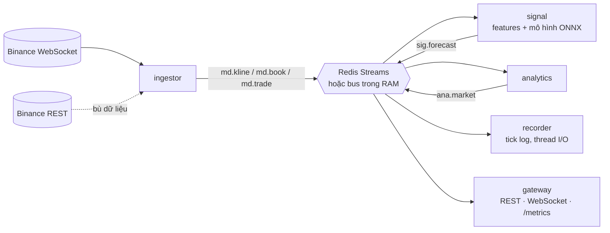

[English](README.md) | **Tiếng Việt**

# Xử lý dữ liệu thị trường realtime: tối ưu CPU và I/O

Hệ thống chạy theo hướng sự kiện (event-driven), nhận dữ liệu thị trường Binance realtime và
làm bốn việc:
- tính features theo kiểu tăng dần (incremental);
- chạy mô hình dự báo CNN → BiLSTM → attention;
- phân tích vi cấu trúc thị trường;
- trả kết quả qua REST và WebSocket.

Hệ thống chạy được dạng microservices qua Redis Streams, hoặc trong một process với bus trong
RAM.

Mô hình không phải chủ đề chính. Chủ đề là **trong một pipeline PyTorch thông thường, bao
nhiêu thời gian bị tiêu vào chi phí phụ thay vì tính toán, và làm sao lấy lại nó trên CPU**:
- điều phối của framework;
- thread pool;
- tính đi tính lại;
- serialization;
- định dạng lưu trữ;
- cách hệ điều hành xếp lịch.

Mọi thứ đều được đo bằng benchmark tái lập được. Số liệu đầy đủ:
**[RESULTS_BENCHMARK.vi.md](RESULTS_BENCHMARK.vi.md)**.

---

## 1. Vấn đề: pipeline PyTorch chưa tối ưu dành phần lớn thời gian cho chi phí phụ

Điểm xuất phát là một pipeline nghiên cứu điển hình, giữ lại trong `ModelTrade/` để đối
chiếu:
- pandas tính lại mọi chỉ báo ở mỗi nến;
- mô hình PyTorch chạy chế độ eager với thread pool mặc định;
- dữ liệu truyền bằng JSON;
- hệ điều hành tự quyết định mỗi thread chạy ở đâu.

Đo trên cùng một máy, trong cùng một phiên:

| Triệu chứng | Số đo |
|---|---|
| **Xử lý mỗi nến chậm, và gần như không phải việc hữu ích** | 35–57 ms mỗi nến. 35–44% dành cho pandas tính lại chỉ báo trên toàn bộ lịch sử, 56–63% cho inference PyTorch eager. |
| **Với batch 1, PyTorch eager chủ yếu là chi phí phụ** | Cùng một mô hình chạy **181 µs** trên ONNX Runtime 1 thread, so với **4,224 µs** trên PyTorch eager 12 thread. Hơn 95% thời gian của lần gọi eager là điều phối của Python cộng đồng bộ thread pool. |
| **Nhiều thread hơn ≠ nhanh hơn** | Inference: PyTorch 1 thread nhanh hơn 12 thread 6.4 lần. Train: 14 thread mặc định của torch chỉ **nhanh hơn 1 thread 1.6 lần** (hiệu suất song song khoảng 12%), và 8 thread chậm hơn 4 thread. |
| **Kiến trúc bỏ qua phần tuần tự** | BiLSTM 2 lớp trên 64 bước tốn khoảng 2.3 ms cho mỗi mẫu train. Rút ngắn phần hồi quy tuần tự (1 lớp trên 32 bước) còn khoảng 0.24 ms: **khoảng 9 lần**. |
| **Pipeline dữ liệu sao chép thay vì đánh chỉ số** | Tạo sẵn mọi cửa sổ train tốn khoảng 645 MB; cắt batch theo chỉ số từ ma trận features chỉ tốn khoảng 7 MB. |
| **Hệ điều hành có thể để core nhanh ngồi không** | EcoQoS của Windows 11 có thể dồn các tiến trình worker chạy nền lên E-core trong khi P-core chỉ bận 10–27%, làm tác vụ hàng loạt **chậm hơn 2–3 lần**. |

Sự lãng phí nằm ở các lớp bao quanh mô hình, không nằm ở phép tính. Vì vậy cách sửa là việc
của kỹ thuật hệ thống: đổi thuật toán, runtime, bố cục bộ nhớ, định dạng truyền tin và lưu
trữ, và cách đặt việc lên CPU.

---

## 2. Những gì đã thay đổi

### 2.1 Đường nóng và I/O

| Điểm nghẽn | Thay đổi | Hiệu quả (tỷ lệ đo trong cùng phiên) |
|---|---|---|
| pandas tính lại ở mỗi nến | Kernel **numba** incremental: trạng thái đệ quy (EMA/RSI/ATR) cộng cửa sổ cố định 64 hàng. Cùng một kernel dùng cho train và chạy live, kiểm chứng giống hệt từng bit. | **1,780×** (micro-benchmark), **483–497×** trong pipeline |
| PyTorch eager, thread mặc định | **ONNX Runtime với 1 intra-op thread**, graph batch tĩnh bằng 1, warm-up khi nạp | **23×** |
| LSTM tuần tự quá dài | Hai lớp conv stride 2 rút chuỗi từ 128 xuống 32 bước trước một lớp BiLSTM | **2.6×** inference, **khoảng 9×** thời gian train mỗi mẫu |
| Sao chép cửa sổ ở mỗi lần inference | **Ring buffer** ghi đôi: *n* hàng mới nhất luôn nằm liền nhau, đưa thẳng vào numba và ONNX Runtime dưới dạng view không sao chép | 2.4–3.2× cho bước chuẩn hóa + tạo input |
| Dict JSON trên đường truyền | Struct **msgspec**, mã hóa **msgpack** dạng mảng | nhanh hơn khoảng 10–11×, nhỏ hơn 2.1–2.5× |
| Parse JSON → dict → `float(str)` | Giải mã thẳng vào struct có kiểu bằng msgspec | 1.24–1.75× |
| Lịch sử nến lưu `.npy` float64 | Định dạng cột **QCOL**: số nguyên int64 có hệ số chính xác → delta → byte-shuffle → zstd, không mất dữ liệu, giải mã song song | **nhỏ hơn 4×** (2.8× so với Parquet+zstd) |
| Không lưu tick | Service `recorder`: tick log chỉ ghi nối tiếp, nén theo khối; nén và ghi đĩa trên một thread I/O riêng | **16 byte/message** trên đĩa, 0.4 µs mỗi message trên event loop |
| Tải REST tuần tự từng trang | Tải song song theo từng đoạn, có thử lại và chờ tăng dần | 86k nến trong 3.6 s |

### 2.2 Thực nghiệm: ghim + hàng đợi động so với Windows điều phối

**Câu hỏi:** trên CPU hybrid, bật toàn bộ core rồi để Windows tự xếp lịch đã đủ chưa? Hay nên
tự điều phối việc một cách tường minh?

Hai khái niệm chính:
- **Ghim** (CPU pinning): cố định mỗi tiến trình vào một CPU logic bằng affinity mask.
- **Hàng đợi động:** không chia việc trước; worker nào xong thì tự lấy phần việc tiếp theo.

**Thiết lập** (`benchmarks/bench_hetero.py`):
- 20 tiến trình worker, mỗi CPU logic một tiến trình; không tính thời gian khởi động tiến
  trình.
- Hai loại tác vụ: inference hàng loạt (nặng SIMD) và giải mã tick cộng analytics (nặng
  Python).
- Mọi worker được thả cùng lúc. Chỉ số đo là **makespan**: thời gian tới khi worker cuối
  cùng xong việc.
- Cùng tổng khối lượng việc cho mọi chiến lược, tiến trình mới cho mỗi cấu hình, xoay vòng
  thứ tự, 3 vòng.
- Mức sử dụng CPU của nhóm P-core và nhóm E-core được ghi lại trong mỗi lần chạy.

**Các chiến lược được so sánh** (tổng cộng 11; đây là các chiến lược chính):

| Chiến lược | Ý nghĩa |
|---|---|
| Bật toàn bộ core + chia đều + Windows xếp lịch (mốc) | mỗi worker nhận lượng việc bằng nhau; Windows tự đặt và di chuyển tiến trình |
| Windows xếp lịch + **hàng đợi động** | worker tự lấy từng phần nhỏ từ một bộ đếm dùng chung cho tới khi hết việc |
| **Ghim + chia đều** | mỗi tiến trình bị cố định vào một CPU logic; lượng việc bằng nhau |
| Ghim + **chia theo tốc độ** | lượng việc tỷ lệ với tốc độ từng core, hiệu chỉnh khi mọi worker cùng chạy |
| **Ghim + hàng đợi động** | vị trí cố định, và core nhanh tự động nhận nhiều phần việc hơn |
| Chỉ P-core + hàng đợi động | tham chiếu: E-core đóng góp được bao nhiêu |

**Kết quả phiên hiện tại** (makespan; tăng tốc so với mốc trong ngoặc):

| Chiến lược | Inference | Ticks | Tỷ lệ rảnh |
|---|---:|---:|---:|
| Bật toàn bộ core, chia đều, Windows xếp lịch (mốc) | 2.81 s | 2.88 s | 9–12% |
| Windows + hàng đợi động | 2.58 s (1.09×) | 2.68 s (1.08×) | 1% |
| Ghim + chia đều | 3.30 s (**0.85×**) | 3.26 s (**0.88×**) | 25–27% |
| Ghim + chia theo tốc độ | 2.57 s (1.09×) | 2.94 s (0.98×) | 9–15% |
| **Ghim + hàng đợi động** | **2.61 s (1.08×)** | **2.64 s (1.09×)** | **1–2%** |
| Chỉ P-core + hàng đợi động | 3.40 s (0.83×) | 4.06 s (0.71×) | 1% |

**Ghim + hàng đợi động so với Windows + hàng đợi động, qua các phiên đo:**

| Phiên | Windows đã làm gì | Inference | Ticks |
|---|---|---:|---:|
| A | EcoQoS dồn worker lên E-core (P-core chỉ bận 12–13%) | ghim nhanh hơn **3.27×** | ghim nhanh hơn **2.60×** |
| B | dùng đủ mọi core | 1.00× | 1.10× |
| C (hiện tại) | dùng đủ mọi core | 0.99× | 1.02× |

**Kết luận:**
1. **Hàng đợi động là cách điều phối nên dùng.** Không cần hiệu chỉnh trước, và giữ thời
   gian rảnh ở mức 1–2%. Qua các phiên, nó nhanh hơn ghim + chia đều **1.07–1.46 lần**.
2. **Ghim + hàng đợi động tương đương Windows + hàng đợi động khi Windows hoạt động bình
   thường** (0.92–1.21×, phần lớn nằm trong nhiễu). Nó **nhanh hơn 2.6–3.3 lần khi Windows
   dồn worker lên E-core**, vì affinity mask khiến việc đó không thể xảy ra. Nó chưa từng
   thua, nên là lựa chọn mặc định an toàn hơn.
3. **Ghim mà vẫn chia đều là lựa chọn tệ nhất.** Worker trên P-core rảnh 25–27% thời gian
   để chờ worker trên E-core.
4. **Chia theo tốc độ đo trước không đáng tin** (0.99–1.28× so với ghim + chia đều): tốc độ
   đã hiệu chỉnh bị lệch trong lúc chạy do Hyper-Threading và nhiệt độ.
5. **Giữ E-core cho tác vụ hàng loạt.** Chỉ dùng P-core chậm hơn 17–29%.
6. **Nguyên nhân của trường hợp xấu: EcoQoS của Windows 11.** Tắt nó bằng
   `SetProcessInformation(ProcessPowerThrottling)` khôi phục mức sử dụng P-core 97–100% và
   nhanh hơn 2–3 lần trong phiên chẩn đoán. Mọi service giờ tự làm việc này khi khởi động
   (`qforecast/core/cpu.py`, `QF_HIGH_QOS=1`).

Về phía **độ trễ**, câu hỏi này có câu trả lời khác. Một event loop realtime phải nhanh ở
mọi lần, nên nó được ghim vào P-core. Lợi ích đo được dao động từ 3.3 lần tới không có gì,
tùy hệ điều hành có định đặt nó lên E-core hay không. Giá trị của việc ghim ở đây là loại
bỏ rủi ro dao động giữa các lần chạy.

---

## 3. Tóm tắt kết quả

| | Trước | Sau | Cải thiện |
|---|---:|---:|---:|
| **Toàn bộ đường xử lý mỗi nến** (đo xen kẽ A/B, KTC 95%) | 35–57 ms | 0.60–1.07 ms | **53–58×** (49–61) |
| Features mỗi nến | 5.5 ms | 3.1 µs | 1,780× |
| Inference mô hình, batch 1 | 4.2 ms (PyTorch eager) | 181 µs (ONNX Runtime, 1 thread) | 23× |
| Mỗi update sổ lệnh (giải mã + đóng gói) | 4.7 µs | 1.1 µs | 4.3× |
| Lịch sử nến trên đĩa | 11.46 MB | 2.88 MB | nhỏ hơn 4× |
| Lưu tick trên đĩa | 146 byte mỗi update | 12.7 byte mỗi update | nhỏ hơn 11.5× |
| Tác vụ hàng loạt: ghim + hàng đợi động so với ghim + chia đều | | | 1.07–1.46× |
| Tác vụ hàng loạt khi EcoQoS xảy ra: ghim + hàng đợi động so với Windows + hàng đợi động | | | 2.6–3.3× |
| Thời gian train mỗi mẫu (nhờ kiến trúc) | ~2.3 ms | ~0.24 ms | ~9× |

Phương pháp đo, mọi bảng số liệu, khoảng dao động giữa các phiên, chẩn đoán EcoQoS, và những
gì chưa đo được: **[RESULTS_BENCHMARK.vi.md](RESULTS_BENCHMARK.vi.md)**.

Số tuyệt đối trên laptop dao động 2–3 lần giữa các phiên; mọi mức cải thiện ở trên là tỷ lệ
đo trong cùng một phiên.

---

## Kiến trúc



| Service | Vai trò |
|---|---|
| `ingestor` | WebSocket và REST, tự kết nối lại với thời gian chờ tăng dần, bù dữ liệu hổng, giải mã có kiểu, phát msgpack |
| `signal` | features incremental → ring buffer đã chuẩn hóa z-score → ONNX Runtime → dự báo; tự nạp model mới khi có |
| `analytics` | spread, microprice, mất cân bằng sổ lệnh và dòng lệnh, regime biến động và xu hướng; O(1) mỗi message |
| `recorder` | ghi tick nén theo khối, I/O đĩa nằm ngoài event loop |
| `gateway` | REST, WebSocket (encode một lần rồi gửi mọi client), metrics Prometheus |
| `trainer` | chạy offline: tải dữ liệu → features → dataset không rò rỉ → train → export ONNX |

## Bắt đầu nhanh

```bash
pip install -r requirements-dev.txt
python -m qforecast.services.all           # mọi service trong một process -> http://localhost:8000
docker compose up -d --build               # phân tán: mỗi service một container + Redis
python -m qforecast.trainer --days 90      # train lại (artifacts/ đã có sẵn model đã train)
```

Các cấu hình hữu ích (biến môi trường):

| Biến | Mặc định | Mục đích |
|---|---|---|
| `QF_CPU_AFFINITY` | *(trống)* | ghim service vào CPU, ví dụ `0,1` |
| `QF_HIGH_QOS` | `1` | Windows 11: tắt EcoQoS |
| `QF_BUS_URL` | `memory://` | `redis://host:6379/0` cho chế độ phân tán |
| `QF_RECORD` | `0` | chạy thêm recorder trong chế độ một process |

## Chạy lại benchmark

```bash
QF_BENCH_PCORES=0-11 python -m benchmarks.bench_before_after   # §1: prototype so với bản tối ưu, đo xen kẽ
QF_BENCH_PCORES=0-11 python -m benchmarks.run_all              # micro-benchmark từng thành phần
QF_BENCH_PCORES=0-11 python -m benchmarks.bench_hetero         # ghim + hàng đợi động so với Windows (~20 phút)
python -m benchmarks.bench_train_threads                       # thông lượng train PyTorch theo số thread
python -m benchmarks.profile_train                             # phân tích một bước train bằng torch.profiler
pytest -q                                                      # 41 test
```

Đặt `QF_BENCH_PCORES` bằng danh sách CPU logic thuộc P-core của máy bạn, hoặc bỏ qua nếu CPU
không phải loại hybrid. Các báo cáo do script sinh ra trong `benchmarks/` chỉ có tiếng Anh.

## Cấu trúc thư mục

```
qforecast/
  core/       features.py (numba), ringbuffer.py, analysis.py, metrics.py, cpu.py (affinity, EcoQoS)
  exchange/   binance.py        tải REST song song, WebSocket tự phục hồi, giải mã có kiểu
  storage/    columnar.py (QCOL), ticklog.py (ghi tick)
  model/      net.py, predictor.py (ONNX Runtime, hot reload); ssm.py, scan_*.py (thử nghiệm GPU, không thuộc phạm vi tài liệu này)
  services/   ingestor, signal, analytics, recorder, gateway, all (một process)
  trainer/    data, dataset không rò rỉ, train, evaluate
benchmarks/   benchmark tái lập được; báo cáo sinh tự động: RESULTS.md, BEFORE_AFTER.md, HETERO.md
tests/        bộ test pytest
deploy/       Dockerfile, cấu hình Prometheus
ModelTrade/   prototype gốc (phiên bản "trước")
```

## Giới hạn

- Mọi số đo đến từ một laptop Windows. Chưa đo các kỹ thuật tinh chỉnh trên Linux
  (`isolcpus`, `SCHED_FIFO`, governor hiệu năng) và thời gian đi qua Redis.
- Mô hình dự báo chưa chứng minh được khả năng dự báo (`artifacts/report.json`). Nó là tác
  vụ được tối ưu, không phải sản phẩm.
